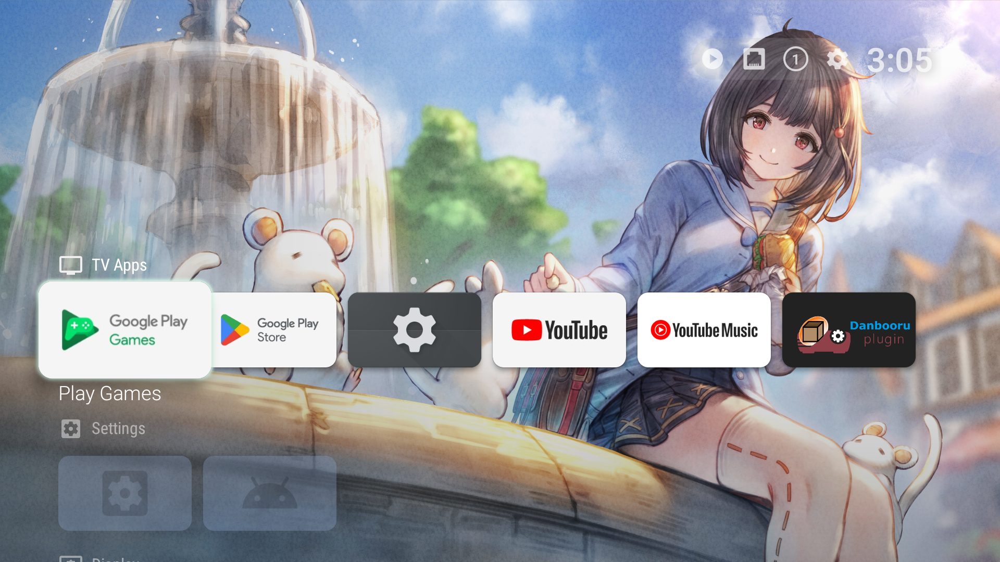
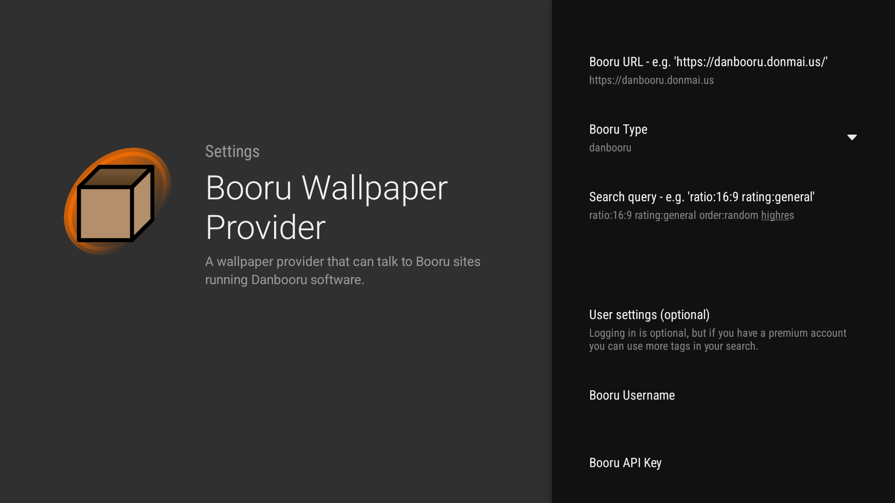

# Projectivy Plugin : Booru Wallpaper Provider

This is a [Projectivy](https://xdaforums.com/t/app-android-tv-projectivy-launcher.4436549/) Plugin that allows you to set a wallpaper from a Booru imageboard.

## Repository layout
- /booru : code for the Booru plugin service and its setting activity
- /api : api used to communicate with Projectivy through AIDL

# Screenshots

# Usage
- Download the `booru-release.apk` from the releases tab and install it on your TV
- Navigate to Projectivy -> Launcher settings -> Appearance -> Wallpaper -> Launcher wallpaper
- The "Booru Wallpaper Provider" should be available.
- Configure the plugin via the "Configure" button. The following settings are available:
  - Booru URL: The base URL to the Booru site, including protocol. For example: `https://danbooru.donmai.us`
  - Booru Type: Only `danbooru`-based boards are currently supported. Support for more types is planned.
  - Search query: The search query from which images are pulled. This is the same as you would fill in on the imageboard website's search box. Check the help pages of your booru for guidance. (i.e. the [cheatsheet](https://danbooru.donmai.us/wiki_pages/help%3Acheatsheet) for Danbooru) All tag types should work normally (including ordering, ratio, and other metatags).
  - Username and API Key: These are optional. Some boorus have limitations on how many tags can be searched anonymously or by standard users. For example, Danbooru allows 2 tags for logged out and normal users, but 6 for premium accounts. Fill in these fields to authenticate. 

## Settings for common boorus
| Booru                                                                             | Type      | URL                                                                        | Query guide                                                               | Username           | API Key                                                                                |
|-----------------------------------------------------------------------------------|-----------|----------------------------------------------------------------------------|---------------------------------------------------------------------------|--------------------|----------------------------------------------------------------------------------------|
| [Danbooru](https://danbooru.donmai.us)  Anime, NSFW and SFW variants           | Danbooru  | `https://danbooru.donmai.us` (NSFW) `https://safebooru.donmai.us` (SFW) | [cheatsheet](https://danbooru.donmai.us/wiki_pages/help%3Acheatsheet)     | Optional, username | Optional, API key. Found on [profile](https://danbooru.donmai.us/profile)              |
| [Konachan](https://konachan.com/)  Anime wallpapers, NSFW and SFW variants     | Moebooru  | `https://konachan.com` (NSFW) `https://konachan.net` (SFW)              | [cheatsheet](https://konachan.net/help/cheatsheet)                        | Optional, username | Optional, hashed password. See [api docs, `Logging in`](https://konachan.net/help/api) |
| [Yande.re](https://yande.re)  Anime, contains NSFW                             | Moebooru  | `https://yande.re`                                                         | [cheatsheet](https://yande.re/wiki/show?title=cheat_sheet_extended)       | Optional, username | Optional, hashed password. See [api docs, `Logging in`](https://yande.re/help/api)     |
| [Gelbooru](https://gelbooru.com)  Anime, contains NSFW                         | Gelbooru  | `https://gelbooru.com`                                                     | [cheatsheet](https://gelbooru.com/index.php?page=wiki&s=&s=view&id=26263) | Optional, username | Optional, API key. Found in account options                                            |
| [Safebooru](https://safebooru.org)  Anime, SFW                                 | Gelbooru  | `https://safebooru.org`                                                    | See `Gelbooru`                                                            | Optional, username | Optional, API key. Found in account options                                            |
| [Zerochan](https://www.zerochan.net) (*)  Anime, SFW                           | Zerochan  | `https://www.zerochan.net`                                                 | Tag names, comma separated. I.e. `Genshin Impact,Lumine`                  | Optional, username | *empty*                                                                                |
| [Asiachan](https://kpop.asiachan.com) (*)  IRL, K-Pop, SFW                     | Zerochan  | `https://kpop.asiachan.com`                                                | Tag names, comma separated. I.e. `BTS,Park Jimin`                         | Optional, username | *empty*                                                                                |
| [Wallhaven](https://wallhaven.cc)  General wallpapers, SFW (NSFW with API key) | Wallhaven | `https://wallhaven.cc`                                                     | [API docs](https://wallhaven.cc/help/api#search)                          | *empty*            | Optional, found in account settings                                                    |

**(*)** Support for Zerochan-type boards is pretty unstable due to how these sites handle requests. Don't expect these to be very stable/usable.

Other known boorus by type

### Other known boorus by type
These are some other boorus listed by their software, sorted into 'SFW' and 'NSFW'.
Take the 'SFW' tag with a grain of salt, you know how the internet works...

| Content rating | Type                     | Known boorus                                                                           |
|----------------|--------------------------|----------------------------------------------------------------------------------------|
| SFW            | Danbooru                 | `yukkuri.shiteitte.net`, `e926.net`                                                    |
|                | Moebooru                 | `sakugabooru.com`, `img.genshiken-itb.org`                                             |
|                | Gelbooru                 | `*.booru.org (some)`                                                                   |
| NSFW           | Danbooru                 | `yukkuri.shiteitte.net`, `booru.allthefallen.moe`, `e621.net`                          |
|                | Gelbooru                 | `*.booru.org`, `xbooru.com`, `rule34.xxx`, `tbib.org`, `hypnohub.net`, `realbooru.com` |
|                | Shimmie2 *(unsupported)* | `rule34.paheal.net`, `rule34hentai.net`, `fanservice.fan`                              |
|                | Sankaku *(unsupported)*  | `chan.sankakucomplex.com`, `idol.sankakucomplex.com`                                   |

# Note
This plugin is provided as an open-source project and is distributed "as is." While the author may offer voluntary support, there is no guarantee of availability or resolution. The author is not responsible for any damages, data loss, or issues arising from the use of this plugin. Use at your own risk.
